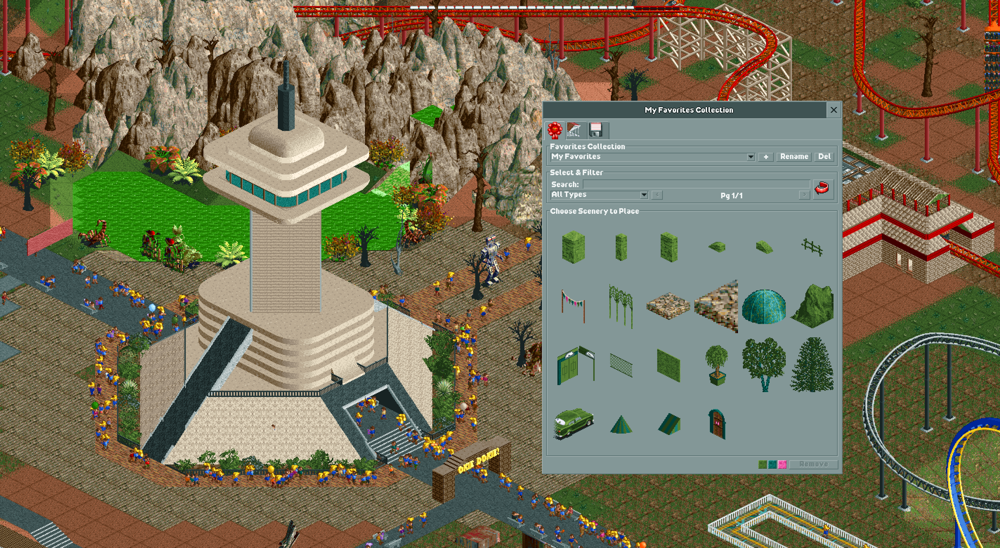

# Favorite Scenery — OpenRCT2 Plugin

A plugin for [OpenRCT2](https://openrct2.io) that lets you build collections of your favorite scenery and place them quickly without hunting through the scenery menus.

## Features

- **Browse all scenery** in a visual 6×7 grid with thumbnails
- **Toggle favorites** — click any scenery item to add or remove it from your active collection
- **Pick from the map** — use the eyedropper to click placed scenery on the map and add it to your collection
- **Place favorites** from your collection with a single click
- **Multiple named collections** — create, rename, and delete collections to organize your scenery
- **Recently placed** view to quickly re-use items you've placed recently
- **Filter by type**: All Types, Small Scenery, Large Scenery, Trees & Plants, Walls, Path Items, Banners
- **Search** by name or object identifier
- **Global color palette** — set primary, secondary, and tertiary colors applied to every item you place
- **Import / Export** collections as JSON to share with others or back up your favorites
- Favorites persist across saves and scenarios via OpenRCT2's shared storage

## Installation

1. Download `favorite-scenery.js`
2. Place it in your OpenRCT2 **plugin** folder:
   - **Windows**: `%APPDATA%\OpenRCT2\plugin\`
   - **macOS**: `~/Library/Application Support/OpenRCT2/plugin/`
   - **Linux**: `~/.config/OpenRCT2/plugin/`
3. Launch or restart OpenRCT2
4. Load a park, then open the plugin from the in-game **Plugin** menu

## How to Use

### First Tab — Favorites

This tab shows the items saved in your active collection. Use it to place your favorites.

| Control | Action |
|---------|--------|
| Collection dropdown | Switch between your named collections |
| **+** button | Create a new collection |
| **Rename** button | Rename the active collection |
| **Delete** button | Delete the active collection (disabled if only one exists) |
| Type dropdown | Filter favorites by type, or choose *Recently Placed* |
| Search box | Filter favorites by name or identifier |
| **Click** a tile | Activate the placement tool for that item — click again to cancel |
| **Remove** button | Hover over a tile to enable it, then click to remove that item from the collection |

### Second Tab — All Scenery

This tab shows every scenery object loaded in the current scenario. Use it to build your favorites collection.

| Control | Action |
|---------|--------|
| Search box | Filter items by name or identifier |
| Type dropdown | Narrow down to a specific scenery category |
| `<` / `>` buttons | Navigate between pages |
| **Click** a tile | Toggle the item in/out of your active collection (pressed = favorited) |
| **Eyedropper** button | Activate the map picker — click placed scenery on the map to toggle it as a favorite |

#### Color Palette

Three color pickers at the bottom of the favorites grid set the **primary**, **secondary**, and **tertiary** colors applied to every item placed through the plugin. Your color choices are saved between sessions.

### Third Tab — Import / Export

Use this tab to share collections or move them between machines.

**To export:**
1. Choose a collection from the dropdown (or *All Collections*)
2. Click **Export**
3. In the dialog that opens, press `Ctrl+A` then `Ctrl+C` to copy the JSON

**To import:**
1. Click **Import JSON...**
2. Paste the JSON you copied from another session and click OK
3. Collections are **merged** — existing collections with matching names get new items added without duplicates; new collection names are created fresh

## Requirements

- OpenRCT2 v0.4.x or later (plugin API support required)

## License

MIT
